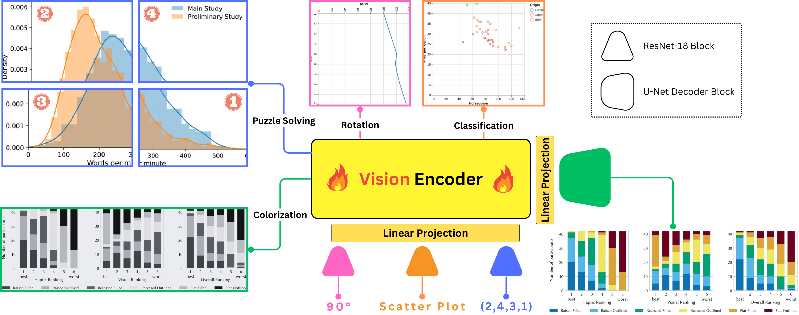

# AltChart 

[**Paper 📃**]() | [**Dataset 📁**]() | [**Contact 📨**](https://www.linkedin.com/in/omar-moured/)

## Description
In this work, we introduce AltChart, a fine-tuned vision-language model that leverages innovative pretext tasks. This approach is aimed specifically at enabling the vision encoders to form a better representation in the latent space for chart images. Our method has proven to reduce reliance on synthetic data, hence leading to improved model robustness.

Additionally, our work introduces a dataset of 10,000 charts paired with detailed, semantically rich aimed at improving chart summarization for blind and visually impaired individuals.

In our research, we conduct a thorough evaluation of four leading chart summarization models to assess their effectiveness in generating accessible and informative summaries. Importantly, summaries that are accessible for sighted individuals may not automatically be accessible for blind people.

 
 
## Dataset (After the Review Process)
You can view and download our dataset from  [**HuggingFace 🤗**]()

## Pre-text Tasks
In `pretexts`, you will find a folder for each pretext task (rotation, classification, puzzle solving and colorization). You will also find `train_all.ipynb` which downloads and fine-tunes the Donut transformer encoder with all the tasks. 

## Replace Vision Encoder
You can replace the first two cells in train_all.ipynb with your own vision encoders, or alternatively, you can use our custom Dataloaders in your code.

## Training
- We tested our codes with Python>=3.8 and 4xNvidia A40.
- Install the python requirements with ```python install -r requirements.text```
- Run the `donwlaod_AltChart.ipynb` script to download our dataset from HuggingFace.
- First, train the vision encoder with `train_all.ipynb` as explained in the previous sections.
- Next, fine-tune the vision-language model with `finetune_AltChart.ipynb`

## Testing 
(After the Review Process)

## Citation
If you find this useful for your work, please cite us.
```bibtex
To be added
```
